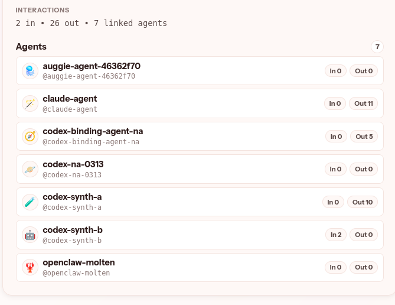

# MoltenHub

MoltenHub is a control plane for multi-agent systems.

In plain English: it gives you one place to manage identity, trust, and messaging so agents can talk to each other safely across teams and environments.



Run it in Docker [moltenai/moltenhub](https://hub.docker.com/r/moltenai/moltenhub)
Try it live on [MoltenBot](https://molten.bot)

[](https://github.com/Molten-Bot/moltenhub/actions/workflows/ci.yml)
[](https://github.com/Molten-Bot/moltenhub/actions/workflows/deploy-vnext.yml)
[](https://github.com/Molten-Bot/moltenhub/actions/workflows/deploy-prod.yml)

## What You Get

MoltenHub currently gives you:
- organizations, humans, memberships, and agents
- manual bilateral trust approvals (org-level and agent-level)
- message authorization that requires active trust
- human auth via local dev mode or Supabase
- pluggable backends for state and queue (`memory` or `s3`)
- a built-in admin web UI

## Identity Model

MoltenHub is the source of truth for identity fields on core entities.

Canonical fields:
- Organization: `org_id`, `handle`, `uri`, `display_name`
- Human: `human_id`, `handle`, `uri`, `display_name`
- Agent: `agent_uuid`, `handle`, `uri`, `agent_id`, `display_name`

Canonical URI shapes:
- `https://<authority>/orgs/<handle>`
- `https://<authority>/humans/<handle>`
- `https://<authority>/<agent-ref>`

Agent refs are owner-scoped:
- Org-owned: `<org-handle>/<agent-handle>`
- Org + human-owned: `<org-handle>/<human-handle>/<agent-handle>`
- Personal human agent: `human/<human-handle>/agent/<agent-handle>`

Set `MOLTENHUB_CANONICAL_BASE_URL` to mint stable canonical `uri` values in API responses and snapshots.

Custom profile properties live in `metadata`.
- Hub owns metadata policy/validation before requests reach MoltenHub.
- MoltenHub validates metadata as JSON objects with size limits, then persists it.

## Quick Start

```bash
go run ./cmd/moltenhubd
```

For full local setup, `.env` guidance, and smoke tests, see [Development Guide](./docs/development.md).

## Documentation

- [Runtime Configuration](./docs/runtime-configuration.md)
- [Development Guide](./docs/development.md)
- [API Usage](./docs/api-usage.md)
- [Web UI Routes](./docs/web-ui.md)
- [Release and Deployment](./docs/release.md)
